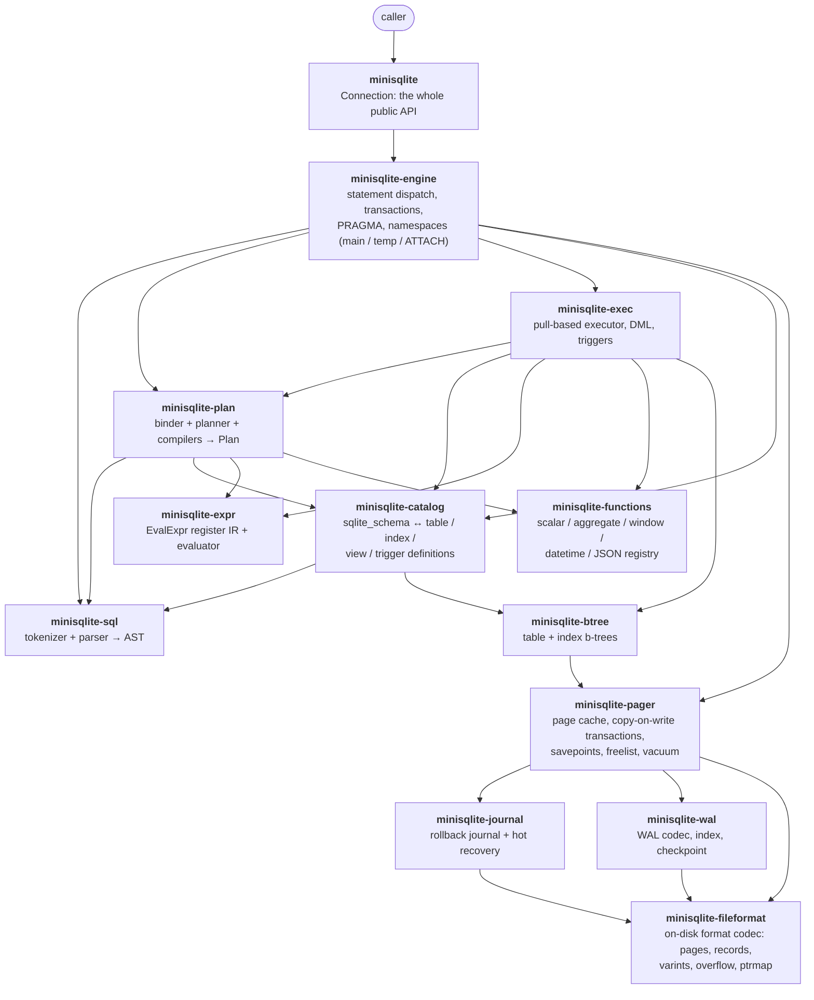
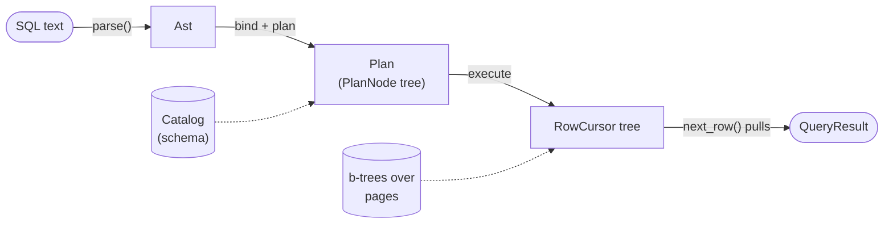
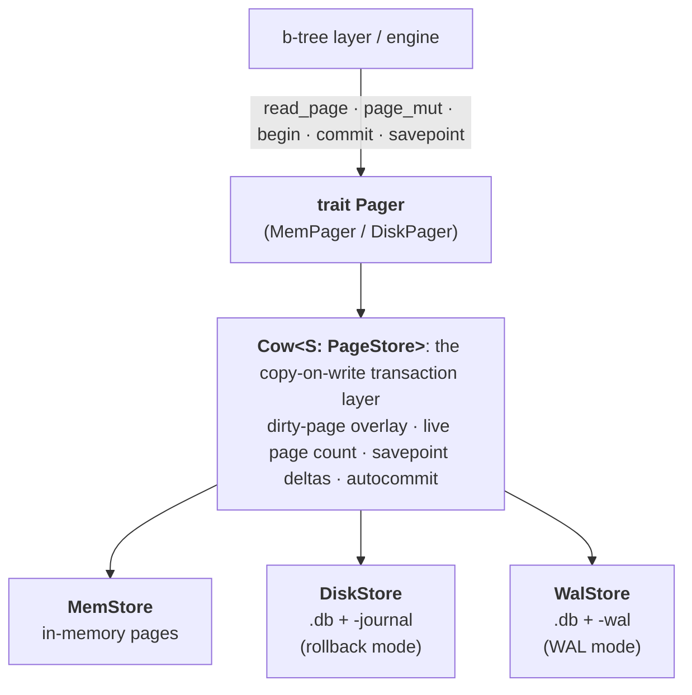
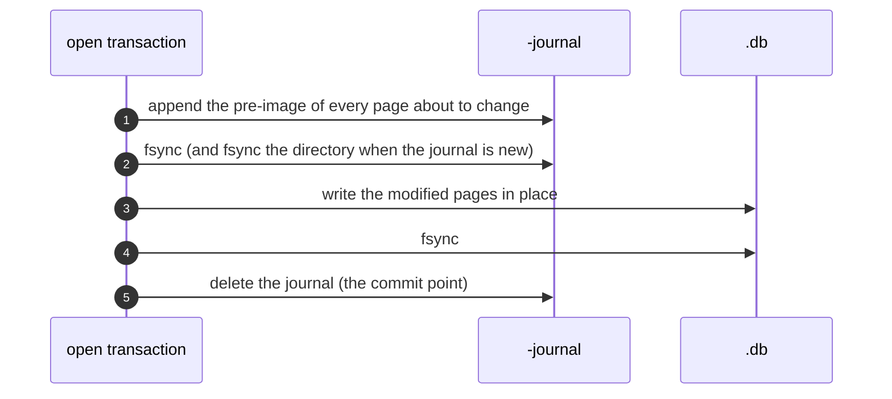

# minisqlite

A reimplementation of SQLite in Rust: the SQL dialect, the query planner and
executor, transactions, and the storage engine, down to the official on-disk
file format. It opens database files that `sqlite3` wrote and writes files
that `sqlite3` reads back.

It is a library with a deliberately small surface: one type, four methods.
The implementation is about 200,000 lines of Rust across 14 crates, with
5,650 tests, one external dependency (`elsa`, for the page cache), and no
`unsafe` in library code.

```rust
use minisqlite::{Connection, Value};
use std::path::Path;

let mut db = Connection::open(Path::new("app.db"))?; // or Connection::open_in_memory()

db.execute(
    "CREATE TABLE users(id INTEGER PRIMARY KEY, name TEXT NOT NULL);
     INSERT INTO users(name) VALUES ('alice'), ('bob');",
)?;

let r = db.query("SELECT id, name FROM users WHERE name LIKE 'a%'")?;
assert_eq!(r.columns, ["id", "name"]);
assert!(matches!(&r.rows[0][1], Value::Text(name) if name == "alice"));
```

That is the whole public API: `Connection::{open, open_in_memory, execute,
query}`, plus the re-exported `Value`, `Row`, `QueryResult`, and `Error`
types. `execute` runs any number of `;`-separated statements; `query` returns
the last statement's result set. `Value` has exactly the five SQLite storage
classes: `Null`, `Integer(i64)`, `Real(f64)`, `Text(String)`, `Blob(Vec<u8>)`.
There is no CLI, no C API, and no prepared-statement interface.

Build and test with a recent stable toolchain (the workspace uses edition
2024):

```console
cargo build --workspace
cargo test  --workspace    # 5,650 tests, about 90 s
cargo bench                # scalability + durability measurement harness
```

## File compatibility

The on-disk format is SQLite's [format 3](https://sqlite.org/fileformat2.html),
in both directions:

```console
$ sqlite3 app.db "CREATE TABLE t(x); INSERT INTO t VALUES ('written by sqlite3')"
$ # ... open app.db with minisqlite, read that row, INSERT 'written by minisqlite' ...
$ sqlite3 app.db "SELECT x FROM t; PRAGMA integrity_check"
written by sqlite3
written by minisqlite
ok
```

This includes the hard cases: WAL databases with a live `-wal` file, UTF-16LE
and UTF-16BE text encodings, auto-vacuum databases with pointer-map pages,
overflow chains, freelists, page sizes from 512 to 65536 bytes, and databases
with reserved bytes at the end of each page. The format tests do not compare
against whatever the engine currently emits; they compare against byte
fixtures transcribed by hand from the file-format spec (see
[Testing](#testing)).

## What is implemented

**Queries.** Joins (`INNER`, `LEFT`, `RIGHT`, `FULL`, `CROSS`, `NATURAL`,
`USING`), `GROUP BY` / `HAVING`, `DISTINCT`, `ORDER BY` / `LIMIT` / `OFFSET`,
compound selects (`UNION [ALL]`, `INTERSECT`, `EXCEPT`), `VALUES`, row values,
scalar / `IN` / `EXISTS` subqueries including correlated ones, `WITH` and
`WITH RECURSIVE`, window functions with the full frame grammar (`ROWS` /
`RANGE` / `GROUPS`, all `EXCLUDE` modes, named `WINDOW` clauses), and the
three built-in collating sequences (`BINARY`, `NOCASE`, `RTRIM`).

**DML.** `INSERT` (`VALUES`, `SELECT`, `DEFAULT VALUES`), `UPDATE` (including
`FROM`), `DELETE`, upsert (`ON CONFLICT ... DO NOTHING / DO UPDATE`, multiple
clauses), `RETURNING`, and the five conflict policies (`OR ABORT / FAIL /
IGNORE / REPLACE / ROLLBACK`) with SQLite's exact undo scopes.

**DDL.** `CREATE` / `DROP` for tables, indexes (`UNIQUE`, partial, on
expressions), views, and triggers (`BEFORE` / `AFTER` / `INSTEAD OF`, `WHEN`,
recursion gated by `PRAGMA recursive_triggers`); `CREATE TABLE ... AS SELECT`;
`ALTER TABLE` (`RENAME TO`, `RENAME COLUMN`, `ADD COLUMN`, `DROP COLUMN`);
`WITHOUT ROWID` tables; generated columns (`VIRTUAL` and `STORED`);
`AUTOINCREMENT` with `sqlite_sequence`.

**Constraints.** `PRIMARY KEY`, `UNIQUE`, `NOT NULL`, `CHECK`, `DEFAULT`, and
foreign keys (`CASCADE`, `SET NULL`, `SET DEFAULT`, `RESTRICT`, `NO ACTION`),
plus deferred constraints rechecked at commit (`DEFERRABLE INITIALLY
DEFERRED`, `PRAGMA defer_foreign_keys`). Constraint errors carry SQLite's
extended result codes and message shapes (`UNIQUE constraint failed: t.x`).

**Transactions.** `BEGIN` / `COMMIT` / `ROLLBACK` and nested `SAVEPOINT` /
`RELEASE` / `ROLLBACK TO`. Statements outside a transaction autocommit.

**Namespaces.** `temp` tables (created lazily, shadow `main` in SQLite's
resolution order), `ATTACH` / `DETACH`, qualified names (`main.t`, `aux.t`),
and cross-database queries, DML, and triggers. An implicit transaction spans
every attached database.

**Functions.** About 90 built-ins: the core string / math / blob scalars
(`printf`/`format`, `substr`, `instr`, `hex`/`unhex`, `quote`, `round`, the
full libm set from `acos` to `trunc`, ...), aggregates (`count`, `sum`,
`total`, `avg`, `min`, `max`, `group_concat`/`string_agg`) with `DISTINCT`,
`FILTER`, and aggregate `ORDER BY`, all eleven window functions, date/time
functions (`date`, `time`, `datetime`, `julianday`, `unixepoch`, `strftime`,
`timediff`) and the JSON family (`json_extract`, `->`/`->>`, `json_set`,
`json_patch`, `json_group_array`/`object`, ..., plus `json_each` and
`json_tree` as real table-valued functions). `LIKE` and `GLOB` match SQLite's
semantics, including `ESCAPE`.

**PRAGMAs.** About two dozen, all accepting a schema qualifier
(`PRAGMA aux.page_count`): header fields (`user_version`, `application_id`, `schema_version`,
`page_size`, `page_count`, `freelist_count`, `encoding`, `auto_vacuum`,
`incremental_vacuum`, `default_cache_size`), introspection (`table_info`,
`table_xinfo`, `index_list`, `index_info`, `index_xinfo`,
`foreign_key_list`, `database_list`, `integrity_check`, `quick_check`, also
callable as table-valued functions: `SELECT * FROM pragma_table_info('t')`),
WAL control (`journal_mode`, `wal_checkpoint`), and behavior flags
(`foreign_keys`, `defer_foreign_keys`, `recursive_triggers`).

**Storage.** Rollback-journal mode and WAL mode with all four checkpoint
modes; crash recovery for both (hot-journal replay, WAL tail validation);
`auto_vacuum` none / full / incremental with real pointer-map pages; `VACUUM
INTO`; `ANALYZE` (writes real `sqlite_stat1` rows); multiple connections in
one process with snapshot-isolated WAL reads and a single-writer lock.

## Architecture

The workspace is 14 crates with a strict dependency direction; each layer
owns one concern and exposes it through one seam.



Arrows are Cargo dependencies. Two edge families are omitted for readability:
every crate depends on `minisqlite-types` (the shared `Value` / `Error`
vocabulary plus the affinity, collation, and comparison rules), and the
layers that decode rows (`catalog`, `exec`, `engine`) also use
`minisqlite-fileformat`'s record codec directly.

| Crate | src LOC | Owns |
|---|---:|---|
| `minisqlite` | 52 | The public facade: `Connection` |
| `minisqlite-engine` | 4.6k | Connection state, statement dispatch, transactions, PRAGMAs, namespaces |
| `minisqlite-sql` | 6.3k | Tokenizer, recursive-descent + Pratt parser, the full AST |
| `minisqlite-plan` | 29.5k | Name/expression binding, access-path selection, statement compilers |
| `minisqlite-exec` | 20.0k | The operator-tree executor, DML, constraints, triggers, windows |
| `minisqlite-catalog` | 14.5k | `sqlite_schema` persistence ↔ typed schema definitions, `ALTER` rewrites |
| `minisqlite-expr` | 2.8k | `EvalExpr`, the register-based expression IR and its evaluator |
| `minisqlite-functions` | 12.2k | The built-in function registry |
| `minisqlite-btree` | 6.6k | Table and index b-trees: insert, delete, balance, cursors |
| `minisqlite-pager` | 9.0k | The `Pager` seam: page cache, copy-on-write transactions, freelist, vacuum |
| `minisqlite-journal` | 1.2k | Rollback-journal format and hot-journal recovery |
| `minisqlite-wal` | 1.4k | WAL format, frame index, checkpoint algorithms (pure, no I/O) |
| `minisqlite-fileformat` | 4.6k | The byte-level format codec (pure, no I/O) |
| `minisqlite-types` | 2.1k | `Value`, `Error`, affinity, collation, comparison |

### The seams are enforced by tests

`crates/minisqlite/tests/seams.rs` pins the architecture mechanically, so
drift is a test failure instead of a convention:

- Exactly one trait per named seam, in its named crate: `Engine`, `Pager`,
  `Catalog`, `Planner`, `Executor`, plus exactly one `pub fn parse` in
  `minisqlite-sql`. There is one engine route; it cannot fork.
- No orphan crates: every crate must have a reverse dependency in the
  workspace (an unused crate is treated as an abandonment signal).
- No Cargo features that select behavior: one build, one live code path.
- No backup files (`.bak`, `.orig`, ...) in the tree.

The intended refactor style is expand-then-contract behind these seams: new
trait methods get fail-closed defaults, backings are swapped underneath, and
the facade stays pinned.

## Life of a statement



1. **Parse.** `minisqlite_sql::parse` tokenizes and parses the whole program
   into an AST. The parser is hand-written recursive descent with a Pratt
   expression parser, covers essentially the whole SQLite grammar, and is
   purely syntactic: no name resolution, no schema access.
2. **Dispatch.** The engine walks the statements. Transaction control, PRAGMA,
   and DDL are handled in the engine layer; `SELECT` / `INSERT` / `UPDATE` /
   `DELETE` go to the planner. Each statement autocommits unless a
   transaction is open.
3. **Bind and plan.** The binder resolves table and column names against the
   catalog and lowers expressions into `EvalExpr`, a register-based IR. By
   execution time there are no names left: only register indices, resolved
   function handles, and comparison metadata (affinity and collation, decided
   at bind time). The planner picks access paths and produces a `Plan`, an
   operator tree with the index-versus-scan decisions already made. The
   executor never re-plans.
4. **Execute.** The executor turns the plan into a tree of `RowCursor`s (the
   classic pull-based Volcano model) and the engine drains it. Execution
   streams: memory is proportional to rows in flight, and the few operators
   that must buffer (sort, hash-join build side, window partition) document
   and bound what they hold. Reads borrow pages from the pager cache all the
   way up; a table-scan row points into page bytes until it is decoded.
5. **Commit.** DML runs inside an implicit or explicit transaction in the
   pager's copy-on-write layer. At commit the dirty pages go to the active
   backing, rollback journal or WAL (both protocols are below).

## The query path

### Parser (`minisqlite-sql`)

The whole crate sits behind one `pub fn parse(sql) -> Result<Ast>`: an
iterative tokenizer and a hand-written parser with explicit depth and width
limits (a hostile 10k-paren expression fails cleanly instead of overflowing
the stack), plus iterative `Drop` impls for deep ASTs. The only statement it
rejects outright is `CREATE VIRTUAL TABLE`.

### Catalog (`minisqlite-catalog`)

The source of truth is page 1's `sqlite_schema` b-tree, exactly as SQLite
stores it: one row per object with its original `CREATE ...` SQL text. The
catalog parses those rows into typed definitions (`TableDef`, `IndexDef`,
`ViewDef`, `TriggerDef`) through the same builders the `CREATE` path uses, and
keeps a case-insensitive cache per database. DDL is applied transactionally:
the schema row and the object's b-tree land in the same pager transaction.
`ALTER TABLE` follows SQLite's model: `RENAME` and `ADD COLUMN` rewrite only
the stored SQL, while `DROP COLUMN` also rewrites every row, streamed.
Dropping an object re-checks dependents (a view over the table, a trigger on
it) before anything is deleted.

### Planner (`minisqlite-plan`)

Access-path selection is a fixed selectivity ladder over the constraints the
`WHERE` clause puts on each table, strongest first:

1. rowid `=` (one row)
2. full-equality seek of a `UNIQUE` index (one row)
3. equality on a prefix of any index
4. rowid range
5. index range
6. full scan

A table uses at most one index (no OR-merge). Whatever the chosen path does
not consume stays in a residual `Filter`. Consuming fewer terms is always
safe, so every uncertain case declines the index and falls back to the
filter: a non-`BINARY` collation, an affinity coercion the raw index seek
can't honor, a runtime value that might be `NULL`. A planning mistake
therefore shows up as a slower query rather than a wrong result.

On top of that:

- **ORDER BY via scan order.** When an index or rowid scan (forward or
  reverse) provably yields the requested order, the sort is dropped.
- **Covering indexes.** A query answered entirely from index columns never
  touches the table b-tree.
- **`min()` / `max()` seeks.** One O(log n) b-tree descent instead of a scan.
- **`count(*)` fast path.** B-tree entry counts, no row decoding.
- **Top-k sorts.** `ORDER BY ... LIMIT k` keeps a k-row bounded heap instead
  of sorting everything.
- **Join strategies.** Hash join for equijoins on `BINARY`-collation keys,
  index-nested-loop when the inner side has a usable index, nested loop
  otherwise. Comma-joins are reordered.
- **Subquery caching.** An uncorrelated scalar subquery runs once per
  statement; a correlated one is memoized on the outer values it actually
  depends on.
- **Recursive CTEs.** Semi-naive evaluation: each round feeds only the
  previous round's new rows.

There is no statistics-based costing: `ANALYZE` writes real `sqlite_stat1`
rows, but the planner does not read them yet. Choices are structural
(uniqueness, prefix length, provable orderings).

### Executor (`minisqlite-exec`)

The executor has about 30 operators, one file each, under `src/ops/`: scans
(sequential, rowid, index), filter, project, join, aggregate, sort, limit,
distinct, set operations, CTE scan and recursive scan, min/max seek, window,
table-valued functions, and the DML family.

- **Rows are registers.** A scan of an N-column rowid table emits width N+1
  with the rowid last; every operator and every bound expression agrees on
  that convention at compile time.
- **DML is two-phase.** Phase one drains the source under a shared borrow
  into a bounded buffer, which also implements SQLite's snapshot semantics
  (`INSERT INTO t SELECT FROM t` sees the pre-insert table). Phase two takes
  the pager exclusively and writes. Index maintenance lives in exactly one
  module (`dml_index`), shared by INSERT / UPDATE / DELETE / backfill, so an
  index entry and its table row cannot disagree by construction.
- **Constraints** (`NOT NULL`, `CHECK`, `UNIQUE`, PK, FK) are checked in the
  write phase and resolved per the statement's `ON CONFLICT` policy; the
  engine layer applies the right undo scope (statement rollback for `ABORT`,
  whole-transaction for `ROLLBACK`, keep-prior-rows for `FAIL`).
- **Foreign keys** are enforced with immediate child-side checks and
  parent-side actions (`CASCADE` recurses through runtime-compiled child
  programs). Deferred FKs
  are rechecked at commit, before the pager commit: a violation fails
  `COMMIT` and leaves the transaction open, as SQLite does.
- **Triggers** are pre-compiled subprograms carried by the DML plan node. Per
  affected row, the executor builds an `OLD ++ NEW` register frame and
  threads it through the same "outer row" mechanism correlated subqueries
  use, so `NEW.x` resolves like any outer column. Recursion is bounded and
  gated by `PRAGMA recursive_triggers`.
- **Window functions** materialize each partition once and then operate on
  row indices. Frame resolution (`ROWS` / `RANGE` / `GROUPS` × all bound
  forms × all four `EXCLUDE` modes) is a pure function tested against the
  spec's worked examples; the default frame gets an O(partition) running
  accumulator instead of a per-row rebuild.

### Functions (`minisqlite-functions`)

A registry keyed by lowercased name and arity, with SQLite's
error wording (`no such function`, `wrong number of arguments`). Scalar and
aggregate namespaces are separate so the binder can classify calls. Special
forms (`coalesce`, `iif`, `CASE`, `LIKE`/`GLOB`) live in the binder;
`json_each` / `json_tree` are table-valued functions plumbed through their own
plan node.

## The storage engine

### On-disk format (`minisqlite-fileformat`)

A database file is an array of same-size pages:

```text
page 1     [ 100-byte database header ][ sqlite_schema b-tree root ]
page 2..N  each one of: table b-tree interior/leaf · index b-tree interior/leaf
           · overflow page · freelist trunk/leaf · pointer-map page (auto_vacuum)
```

`minisqlite-fileformat` is the codec for all of it: the header, the four
b-tree page types and their cells, records (the varint serial-type encoding
used for both table rows and index keys), overflow spill math and chains,
freelist trunk pages, and pointer maps. It is a pure codec: no file I/O, no
caching, no transactions. Decoders borrow from the page slice instead of
copying. Everything above it goes through this one codec, so the format is
defined in exactly one place.

### B-trees (`minisqlite-btree`)

As in SQLite, there are two tree shapes:

- **Table b-trees** are B+-like: rows live only in leaves, keyed by rowid;
  interior pages hold rowid separators. (`WITHOUT ROWID` tables store rows in
  an index b-tree keyed by their primary key instead.)
- **Index b-trees** are classic B-trees: an interior divider is itself a real
  index entry, present exactly once in the tree, and cursors interleave
  dividers in order.

Inserts try an in-place cell splice first (O(cell), via the pager's in-place
page edit) and fall back to rebuilding the page; overflow forces an N-way
split that propagates up the recorded descent path, growing the tree at the
root so the root page number never changes. Deletes maintain three invariants
bottom-up: separators track the left subtree's maximum; no interior page
points at an empty child; no non-root interior page falls under minimum
occupancy. The fixes are retargeting, rotation through the parent separator,
or a merge, and orphaned pages go to the freelist. Payloads larger than the
spill threshold continue into overflow chains, using the spec's exact split
formula. `count(*)` is answered by walking the tree and summing cell counts
without decoding a single record.

### Pager (`minisqlite-pager`)

The pager is the one storage seam: the engine holds `Box<dyn Pager>`, and
the b-tree layer does all its reads and writes through it.



The transaction layer is written once and shared by every backing: a
transaction is a dirty-page overlay (`HashMap<PageId, Box<[u8]>>`) plus a live
page count; reads consult the overlay, then the committed store; rollback
drops the overlay; commit hands the dirty set to the store's single mutation
point, `apply_commit`. Savepoints are bounded pre-image deltas inside the
overlay, so `ROLLBACK TO` never touches the store. Backings only answer
"where do committed pages live", so mode differences cannot leak into
transaction semantics.

Two properties matter:

- **Reads borrow, never copy.** `read_page` returns `&[u8]` into the page
  cache. The cache is append-only with stable addresses (`elsa::FrozenMap`,
  the workspace's one external dependency), so a borrow survives later
  load-on-miss inserts without `unsafe`.
- **Writes are copy-on-write.** `page_mut` adds an in-place O(edit) fast path
  once a page is already dirty in the transaction.

The pager also owns allocation policy: freelist reuse is O(1) amortized and
touches only page 1 plus one trunk page. At commit it maintains the page 1
header (the change counter and the in-header database size, kept consistent
so a real `sqlite3` accepts them). And it owns auto-vacuum: pointer maps are
derived at commit by walking the b-tree forest, so they cannot drift from the
actual structure; `incremental_vacuum` relocates tail pages into free slots
and truncates; full-vacuum compaction runs inside the same durable
transaction as the commit that triggered it. Every relocation re-verifies the
forest before truncating, and a pass that cannot verify rolls back rather
than risking corruption.

### Commit protocols

Rollback-journal mode is the default; commit follows SQLite's atomic-commit
protocol:



A crash before step 5 leaves a hot journal; the next `open` replays it
(multi-segment, checksum-validated, idempotent) and the database is back at
the previous commit. A crash after step 5 keeps the new state.

WAL mode (`PRAGMA journal_mode=wal`):

```mermaid
sequenceDiagram
    autonumber
    participant T as open transaction
    participant W as -wal
    participant D as .db

    T->>W: append one frame per dirty page
    T->>W: mark the last frame as the commit frame (new db size)
    T->>W: fsync (the commit point)
    Note over D: the .db file is untouched; readers keep their snapshots
    Note over W,D: a later checkpoint copies committed frames into the .db,<br/>then the WAL can be reset from the start
```

Reads in WAL mode resolve each page against a pinned snapshot: the last
commit frame at the time the read transaction began. The WAL frame index is
maintained incrementally (extended per commit, never re-scanned). On open,
the recovery pass validates salts and cumulative checksums frame by frame and
stops at the first torn frame, which is exactly the rule SQLite uses to find
the valid WAL prefix. Checkpoints (`PASSIVE` / `FULL` / `RESTART` /
`TRUNCATE`) are bounded by the oldest live reader and only ever copy up to a
commit boundary.

The two side-file formats are their own crates (`minisqlite-journal`,
`minisqlite-wal`) so the checksum math and recovery algorithms are testable
as pure functions; the pager owns the actual file I/O.

## Transactions, namespaces, and the engine layer

`minisqlite-engine` holds per-connection state, one entry per namespace: a
pager, a schema catalog, and a name for `main` (index 0), `temp` (index 1,
created lazily on first use), and each `ATTACH`ed database (index 2 and up).
Statement dispatch, `BEGIN` /
`COMMIT` / `ROLLBACK`, the savepoint name stack, the deferred-FK commit
check, `ANALYZE`, `VACUUM INTO`, and all PRAGMAs live here. A write statement
runs in a transaction spanning every attached database; `ATTACH` inside an
open transaction enrolls the new database in it.

`PRAGMA journal_mode` switches the mode bytes in the file header; the backing
is chosen when a database is opened, so a switch takes effect for connections
opened after it (the mode is fixed for the life of a handle).

## Concurrency

Multiple `Connection`s to the same file work within one process:

- **Rollback mode:** each connection re-validates its committed view at every
  transaction boundary via the header's change counter (a 100-byte read;
  the cache is dropped only when the counter moved).
- **WAL mode:** connections to the same canonical path coordinate through a
  process-global registry: readers pin a snapshot (the last commit frame at
  `begin_read`), writers take a try-lock, and a second concurrent writer gets
  `database is locked` immediately rather than blocking. Checkpoints never
  overwrite a page a live reader can still see.

The boundary is deliberate and documented: coordination is in-process only.
There is no OS-level file locking and no `-shm` shared-memory protocol, so
concurrent access from separate processes is not protected the way real
SQLite's POSIX locks protect it. One process at a time is the supported
model; the files on disk are valid format 3 at every commit boundary, so
handing a database from one process to another is fine.

## Testing

The workspace has 5,650 `#[test]` functions; `cargo test --workspace` runs
them in about 90 seconds.

**Conformance tests.** 110 `conformance_*.rs` files run against the public
facade only. The methodology is stated at the top of nearly every file: every
expected value is transcribed from the SQLite documentation (each file cites
its sections, e.g. `datatype3.html §3.4`, `windowfunctions.html §2.2`), never
from what the engine currently returns. A failing assertion is the signal
that the engine diverges from the spec; assertions are not weakened to pass.
Coverage includes the affinity and comparison tables, null three-valued
logic, collations, every join shape, window frames against the spec's worked
examples, trigger semantics, foreign-key actions, upsert, generated columns,
`WITHOUT ROWID`, JSON, date/time, and cross-namespace behavior.

**Format and durability tests.** The on-disk format is checked against
hand-built byte fixtures transcribed from the file-format spec, with every
non-obvious byte justified by a comment citing its field and offset. The
fixtures are deliberately not produced by the engine's own writers, so the
check is not circular, and both directions are tested: parse the fixture and
check every field, then write the same logical content and compare
byte-for-byte. Crash recovery is tested by fabricating crash states at the
byte level (hot journals, torn WAL frames, half-applied checkpoints) and
reopening. UTF-16 and auto-vacuum images, the files a naive reader gets
wrong, have their own fixtures.

**Architecture tests.** The `seams.rs` suite described
[above](#the-seams-are-enforced-by-tests).

The in-repo suite never invokes a `sqlite3` binary (differential testing
against real SQLite happens outside this repo). The two-way compatibility
demo under [File compatibility](#file-compatibility) is easy to reproduce
locally with any `sqlite3` build.

## Benchmarks

`cargo bench` runs a std-only harness (a plain `fn main`, no bench framework)
that sweeps five workloads over 1k / 10k / 100k / 1M rows: indexed point
lookup, range scan, equi-join, group-by, and correlated subquery. It reports
wall-clock time, peak heap (via a counting global allocator), and peak RSS
(Linux `VmHWM`), then exercises a durability round trip: write on disk, roll
back a delete, reopen, verify. Nothing in it gates a build; the point is to
expose a quadratic plan or a statement that copies the whole database.

## Source layout

Every `lib.rs` is a thin hub: it declares submodules and re-exports; real
code lands in one file per concern. Doc comments throughout cite the SQLite
documentation they implement (`fileformat2.html`, `datatype3.html`,
`atomiccommit.html`, ...). Those references point at the official SQLite docs
at [sqlite.org/docs.html](https://sqlite.org/docs.html); the spec is not
vendored into this repository.

```text
crates/
  minisqlite/             the facade + the conformance/seams/smoke test suites + benches
  minisqlite-engine/      dispatch.rs txn.rs pragma.rs namespace.rs attach.rs vacuum.rs ...
  minisqlite-sql/         token.rs keyword.rs ast_*.rs parser/
  minisqlite-plan/        bind/ access_path.rs compile/ planner.rs query_planner.rs
  minisqlite-exec/        executor.rs runtime.rs ops/ (one operator per file)
  minisqlite-catalog/     schemacatalog.rs schema_row.rs def.rs builder.rs alter_data.rs ...
  minisqlite-expr/        eval.rs pattern.rs
  minisqlite-functions/   scalar/ agg/ datetime/ json/ registry.rs
  minisqlite-btree/       tree.rs insert.rs delete.rs cursor.rs index*.rs overflow_io.rs
  minisqlite-pager/       pager.rs cow.rs store.rs diskstore.rs walstore.rs alloc.rs ...
  minisqlite-journal/     codec.rs writer.rs recover.rs
  minisqlite-wal/         codec.rs checksum.rs index.rs checkpoint.rs
  minisqlite-fileformat/  header.rs page.rs page_edit.rs serial.rs varint.rs overflow.rs ...
  minisqlite-types/       value.rs error.rs affinity.rs cast.rs compare.rs collation.rs
```
