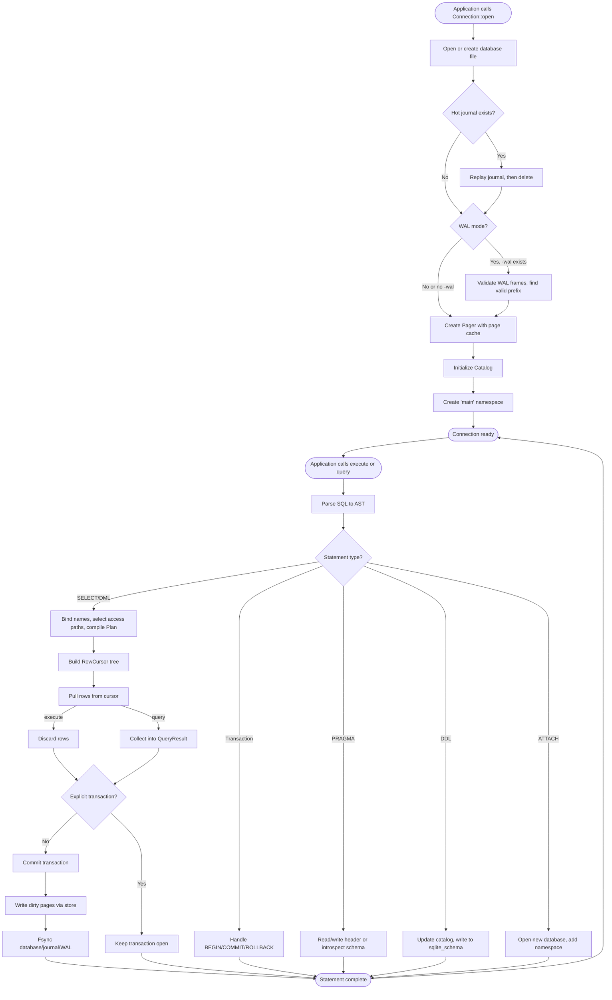

# Runtime Flow

This document explains how minisqlite starts and processes SQL statements.

## Main Commands/Scripts

minisqlite is a library with no CLI or scripts.

Applications link it and call its Rust API directly.

**Build:**
```
cargo build --workspace
```

**Test:**
```
cargo test --workspace
```

**Benchmark:**
```
cargo bench
```

## Entrypoint Files

The public API is in `crates/minisqlite/src/lib.rs`.

Applications create a `Connection` by calling:
- `Connection::open(path)` for on-disk databases
- `Connection::open_in_memory()` for transient databases

These constructors delegate to `minisqlite-engine`:
- `minisqlite_engine::open(path)` creates a `DiskEngine`
- `minisqlite_engine::open_in_memory()` creates a `MemEngine`

Both implement the `Engine` trait, which the facade holds as `Box<dyn Engine>`.

## Database Opening Flow

**On-disk database (`Connection::open`):**

1. The engine creates a `DiskStore` backed by the file at the given path.

2. If the file exists, the store reads the database header (first 100 bytes of page 1).

3. The header reveals the journal mode (rollback or WAL) and page size.

4. If a `-journal` file exists, hot-journal recovery runs: the journal is replayed to restore the previous commit, then deleted.

5. If in WAL mode and a `-wal` file exists, WAL recovery validates frames and finds the valid WAL prefix.

6. A `Pager` wrapping the store is created with an initially empty page cache.

7. A `Catalog` is initialized, which lazily loads schema definitions from `sqlite_schema` on first access.

8. The engine creates the `main` namespace (index 0) with this pager and catalog.

**In-memory database (`Connection::open_in_memory`):**

1. The engine creates a `MemStore` with no file backing.

2. A fresh database header is written to page 1, and an empty `sqlite_schema` B-tree is initialized.

3. A `Pager` and `Catalog` are created as above.

4. The engine creates the `main` namespace.

## Statement Execution Flow

**When the application calls `Connection::execute(sql)` or `Connection::query(sql)`:**

### 1. Parsing

The SQL text is passed to `minisqlite_sql::parse`, which returns an AST.

The parser handles `;`-separated statements, so one call can produce multiple AST nodes.

Parsing is purely syntactic: no name resolution or schema access.

### 2. Dispatch

The engine walks the AST statements in order.

For each statement, the dispatcher routes it based on type:

- **Transaction control** (`BEGIN`, `COMMIT`, `ROLLBACK`, `SAVEPOINT`, `RELEASE`): Handled in `txn.rs`.

- **PRAGMA**: Handled in `pragma.rs`. PRAGMAs can read or modify header fields, introspect the schema, or control WAL checkpoints.

- **DDL** (`CREATE`, `DROP`, `ALTER`): Handled in the engine layer. Schema changes update the catalog and write to `sqlite_schema`.

- **ATTACH/DETACH**: Handled in `attach.rs`. Opens a new database and adds it to the namespace vector.

- **VACUUM INTO**: Handled in `vacuum.rs`. Copies the database into a new file.

- **ANALYZE**: Handled in `analyze.rs`. Writes statistics to `sqlite_stat1`.

- **SELECT/INSERT/UPDATE/DELETE**: Delegated to the planner and executor.

Statements outside an explicit transaction autocommit: each statement begins and commits its own transaction.

### 3. Binding and Planning

For DML and queries, the engine passes the AST to the planner.

**Binding:**

The binder resolves table and column names against the catalog.

Expressions are lowered into `EvalExpr`, a register-based IR.

By this stage, all names are replaced with register indices, resolved function handles, and comparison metadata.

**Planning:**

The planner selects access paths (index vs. scan) based on a fixed selectivity ladder.

The planner produces a `Plan`: an operator tree with all decisions made.

The executor never re-plans.

### 4. Execution

The executor turns the plan into a tree of `RowCursor`s.

Each operator pulls rows from its children (Volcano model).

For `execute()`, the engine drains the cursor and discards rows.

For `query()`, the engine collects rows into a `QueryResult` and returns them.

**DML (INSERT, UPDATE, DELETE) is two-phase:**

1. **Phase one:** Drain the source query under a shared borrow into a bounded buffer. This implements SQLite's snapshot semantics.

2. **Phase two:** Take the pager exclusively and write. Check constraints, update indexes, fire triggers.

### 5. Commit

**Explicit transactions:**

If the application called `BEGIN`, the transaction remains open until `COMMIT` or `ROLLBACK`.

Multiple statements accumulate dirty pages in the same transaction.

**Autocommit:**

If no explicit transaction is open, the statement's transaction commits automatically at the end.

**Commit protocol:**

Dirty pages are handed to the store's `apply_commit` method.

In rollback-journal mode, the store writes pre-images to the journal, fsyncs, writes modified pages, fsyncs, then deletes the journal.

In WAL mode, the store appends frames to the WAL, marks the last frame as a commit frame, and fsyncs.

## What Happens Once Running

Once the database is open, the connection is idle until the application calls `execute()` or `query()`.

There is no background activity, no daemon, no network listener.

The connection holds an open file handle (in disk mode) and a page cache.

Reads are on-demand: pages are loaded into the cache as queries access them.

Writes accumulate in the dirty-page overlay until commit.

## Local/Dev/Test/Prod Modes

minisqlite has no environment-specific modes.

The build is uniform: `cargo build` produces the same binary for all environments.

Tests run the same code path as production.

The only runtime variation is:
- **On-disk vs. in-memory:** Controlled by which constructor the application calls.
- **Rollback-journal vs. WAL mode:** Controlled by `PRAGMA journal_mode`.

No conditional compilation, no feature flags, no build-time configuration.

## Runtime Flow Diagram


