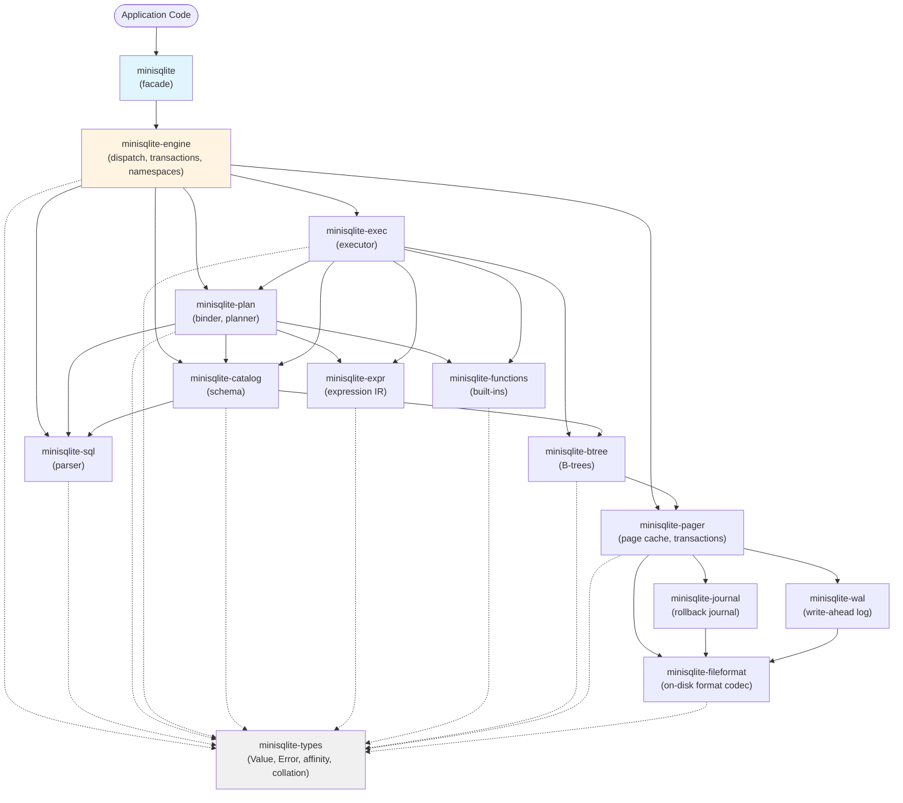
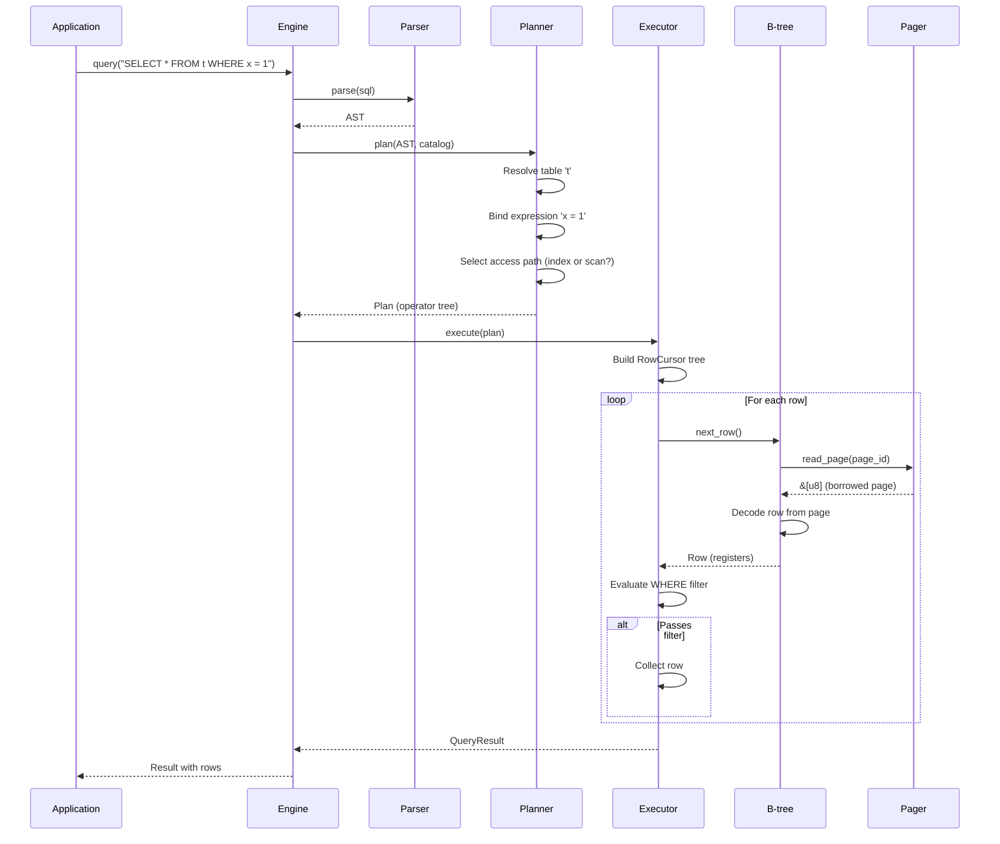
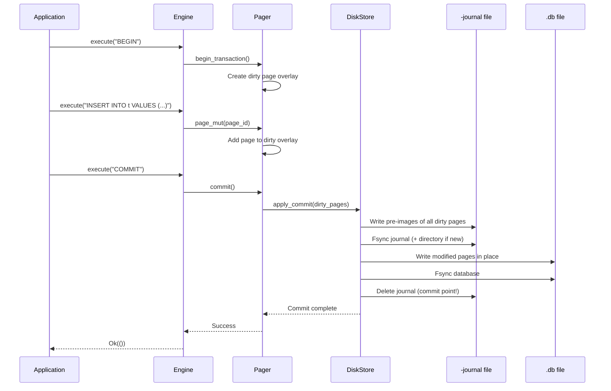
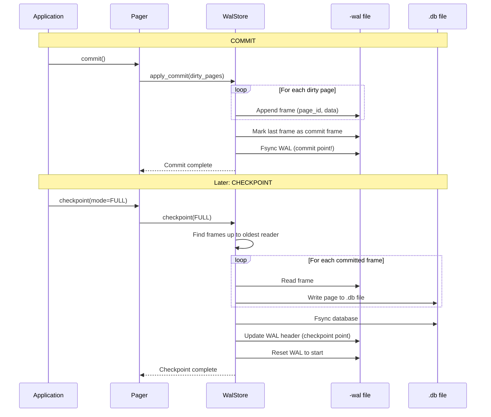
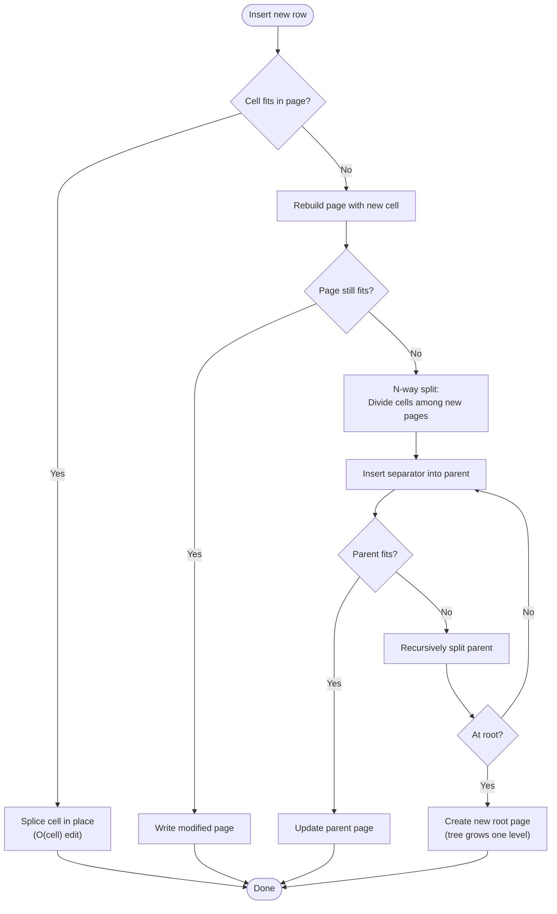
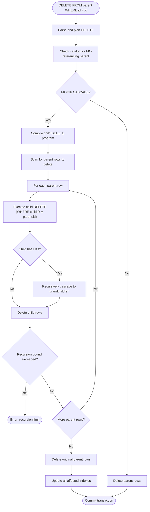
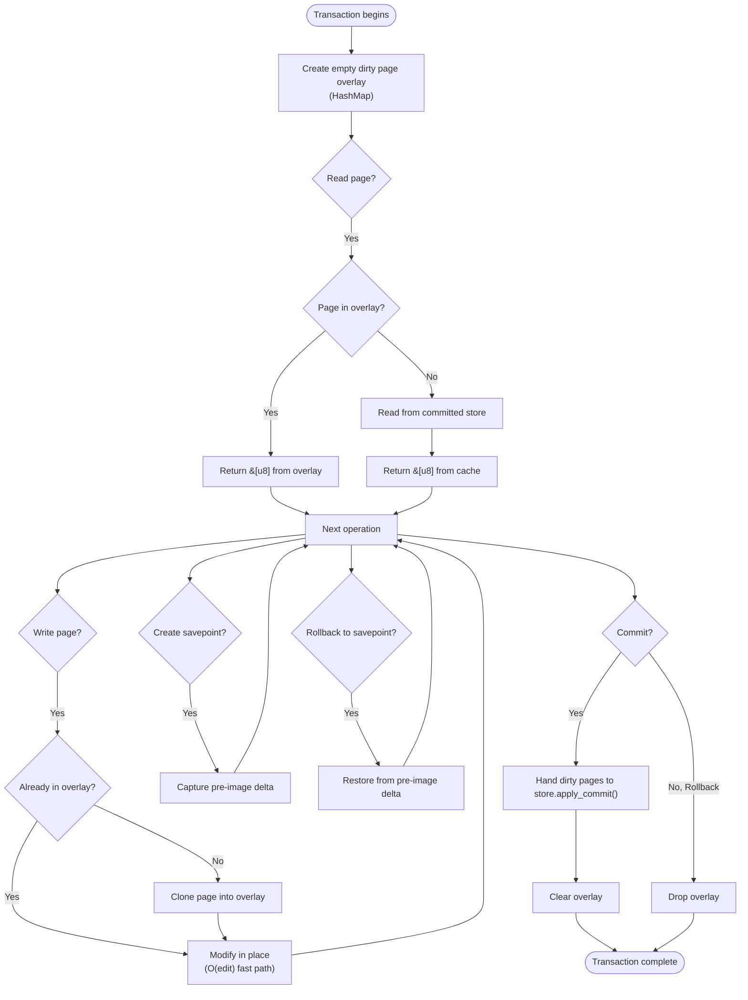

# Diagrams

This document contains Mermaid diagrams illustrating the architecture and behavior of minisqlite.

## 1. Crate Dependency Graph

This diagram shows the 14 crates and their dependencies, enforcing the layered architecture.

**Legend:**
- Solid arrows: Direct crate dependencies (in Cargo.toml)
- Dashed arrows: Dependency on `minisqlite-types` (omitted from most diagrams for clarity)

## 2. Statement Execution Flow

This diagram shows the path of a SQL statement from text to result.

```mermaid
graph LR
    SQL["SQL Text"] -->|parse| AST["Abstract Syntax Tree"]
    AST -->|dispatch| ROUTE{Statement Type?}
    
    ROUTE -->|DDL| DDL_HANDLER["DDL Handler<br/>(CREATE, DROP, ALTER)"]
    ROUTE -->|Transaction| TXN_HANDLER["Transaction Handler<br/>(BEGIN, COMMIT, etc.)"]
    ROUTE -->|PRAGMA| PRAGMA_HANDLER["PRAGMA Handler"]
    ROUTE -->|DML/Query| PLANNER["Planner"]
    
    DDL_HANDLER --> CATALOG_UPDATE["Update Catalog"]
    CATALOG_UPDATE --> COMMIT
    
    PLANNER -->|bind names| BINDING["Name Resolution"]
    BINDING -->|select paths| ACCESS["Access Path Selection"]
    ACCESS -->|compile| PLAN["Plan (Operator Tree)"]
    
    PLAN --> EXECUTOR["Executor"]
    EXECUTOR --> CURSOR["RowCursor Tree"]
    CURSOR -->|pull rows| BTREE_OPS["B-tree Operations"]
    BTREE_OPS --> PAGES["Page Access"]
    
    PAGES --> RESULT["Result Rows"]
    TXN_HANDLER --> COMMIT{Commit?}
    PRAGMA_HANDLER --> DONE
    RESULT --> COMMIT
    
    COMMIT -->|Yes| WRITE["Write Dirty Pages"]
    COMMIT -->|No| DONE["Done"]
    WRITE --> FSYNC["Fsync"]
    FSYNC --> DONE
    
    style SQL fill:#e1f5ff
    style RESULT fill:#e1ffe1
    style DONE fill:#ffe1e1
```

## 3. Query Planning and Execution Sequence

This diagram shows the detailed steps for planning and executing a SELECT query.

## 4. Transaction Commit with Rollback Journal

This diagram illustrates the atomic commit protocol in rollback-journal mode.

## 5. WAL Mode Commit and Checkpoint

This diagram shows how WAL mode handles commits and checkpoints.

## 6. B-tree Insert with Split

This diagram shows how B-tree insert handles page overflow.

## 7. Foreign Key Cascade Flow

This diagram illustrates how foreign key CASCADE actions work.

## 8. Copy-on-Write Transaction Layer

This diagram shows how the COW layer manages dirty pages and savepoints.

All diagrams render correctly in GitHub-flavored Markdown.
